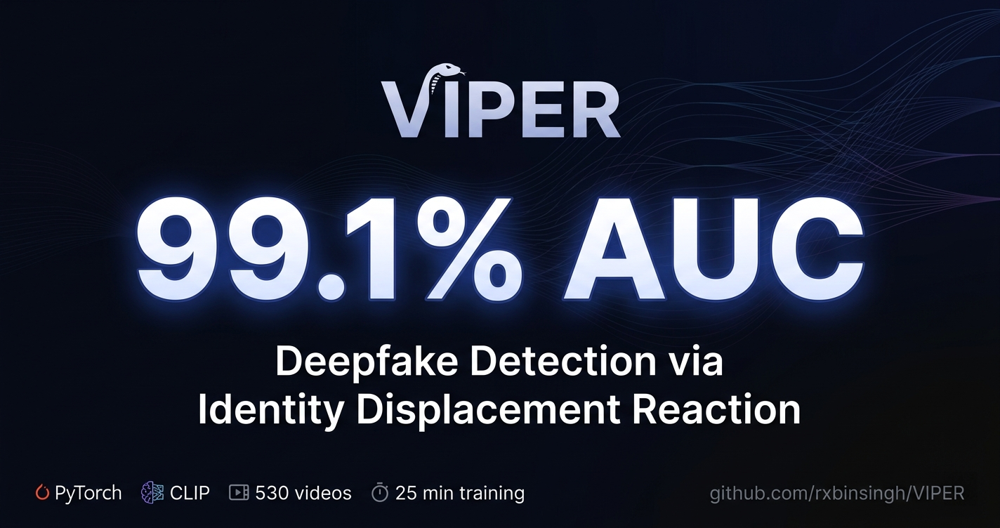
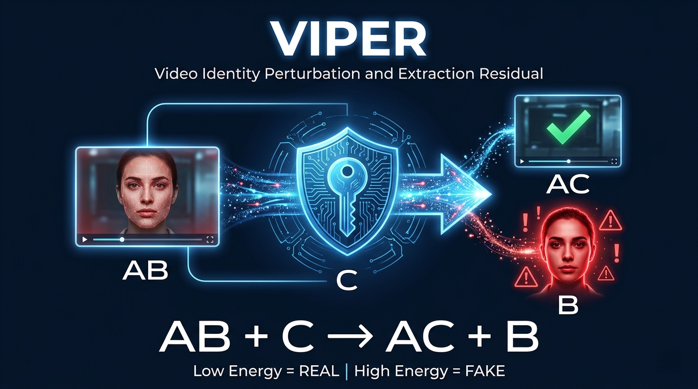
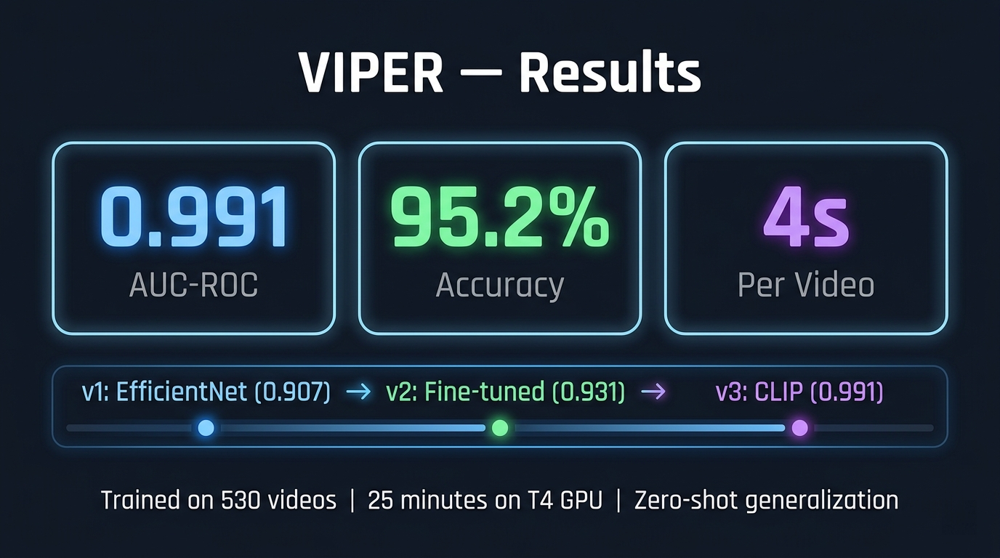
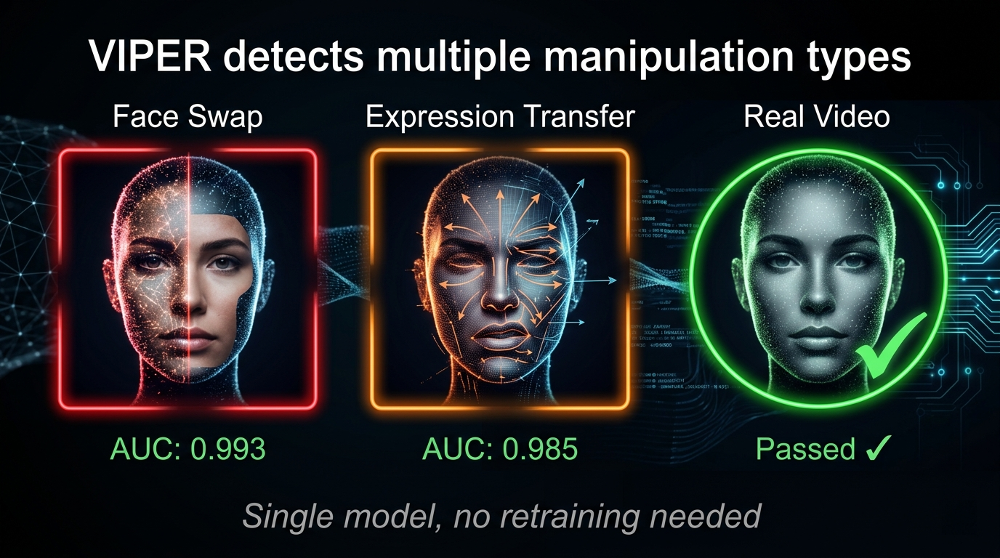
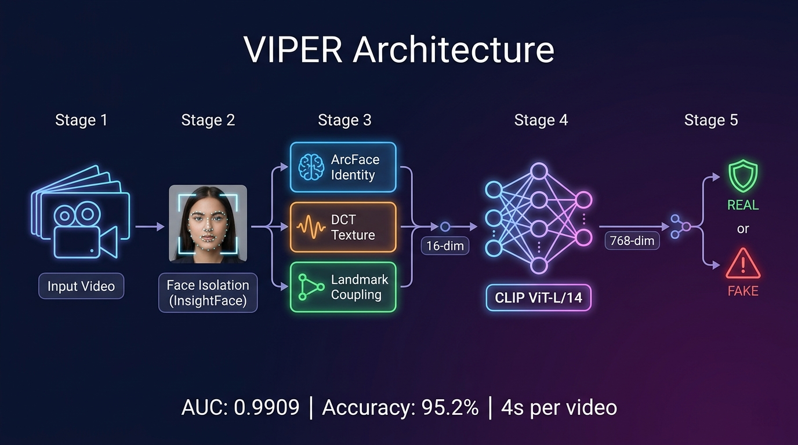

# VIPER: Video Identity Perturbation and Extraction Residual

**Deepfake detection inspired by displacement reactions in chemistry.**

[](https://colab.research.google.com/github/rxbinsingh/VIPER/blob/main/notebooks/VIPER_Train_Colab.ipynb)
[](https://huggingface.co/rxbinsingh/VIPER)
[](https://huggingface.co/spaces/rxbinsingh/VIPER)
[](LICENSE)
[](https://www.python.org/)

---



---

## Core Idea

> *What if we could expose deepfakes the way chemistry exposes impurities?*

VIPER introduces an identity anchor (reagent C) to each video frame (compound AB). If the face is real, the anchor bonds cleanly. If it's fake, the bond fails — the synthetic face is displaced and exposed.



```
AB + C → AC + B

AB  =  video frame (fake face B inside context A)
C   =  identity anchor (biometric reference from first 8 frames)
AC  =  anchor bonds successfully (REAL — low energy)
B   =  fake face displaced/exposed (FAKE — high energy)
```

---

## Results



| Metric | Value |
|:-------|------:|
| **AUC-ROC** | **0.9909** |
| **Accuracy** | **95.2%** |
| **Fake Recall** | **96.5%** |
| Face-swap AUC | 0.9931 |
| Expression-swap AUC | 0.9847 |
| Inference | ~4s per video |
| Training time | 25 min on T4 GPU |
| Training data | 530 videos |

### Per-Manipulation-Type Detection



| Attack Type | AUC | Accuracy |
|:------------|----:|--------:|
| Face swap (inswapper) | 0.9931 | 95.6% |
| Expression transfer (NeuralTextures) | 0.9847 | 93.7% |
| **Combined** | **0.9909** | **95.2%** |

### Model Progression

| Version | Backbone | Test AUC |
|:--------|:---------|--------:|
| v1 | EfficientNet-B4 (frozen) | 0.9072 |
| v2 | EfficientNet-B4 (fine-tuned) | 0.9309 |
| **v3** | **CLIP ViT-L/14 (frozen) + TTA** | **0.9909** |

---

## Architecture



```
Video → InsightFace face detection → 16 face crops (224×224)
         │
         ├── Identity Anchor (ArcFace + DCT + dlib)
         │   → GIR + TFR + BCR → 16-dim analytical features
         │
         └── CLIP ViT-L/14 (frozen) → 768-dim video embedding
                   │
                   ▼
         Fusion MLP [784 → 512 → 128 → 1] + TTA → REAL / FAKE
```

### Three Biometric Signals

| Signal | Method | Measures |
|:------:|:-------|:---------|
| **GIR** | ArcFace cosine distance | Geometric identity consistency |
| **TFR** | DCT KL divergence | Texture frequency consistency |
| **BCR** | dlib landmark coupling matrix | Biomechanical motion consistency |

---

## Quick Start

### Live Demo

Try it now: [huggingface.co/spaces/rxbinsingh/VIPER](https://huggingface.co/spaces/rxbinsingh/VIPER)

### Colab (T4 GPU — full training)

[](https://colab.research.google.com/github/rxbinsingh/VIPER/blob/main/notebooks/VIPER_Train_Colab.ipynb)

### Local

```bash
git clone https://github.com/rxbinsingh/VIPER
cd VIPER
pip install -r requirements.txt
python app.py
```

### Python API

```python
import torch
from src.clip_model import load_viper_v3

model = load_viper_v3(checkpoint_path="checkpoints/viper_best_v3_clip.pt")
# Process video → face crops → model(crops, hand_feats) → sigmoid → P(fake)
```

---

## Training

### 1. Upload dataset to Google Drive

```
MyDrive/VIPER/dataset_production/
    real/               ← 250 real videos
    face_swap/          ← 220 face-swap deepfakes
    expression_swap/    ← 60 expression-swap deepfakes
    fullbody_gan/       ← 50 GAN deepfakes
    metadata.csv
```

### 2. Open Colab notebook

Open `notebooks/VIPER_Train_Colab.ipynb` from GitHub in Colab with T4 GPU runtime.

### 3. Run all cells

- Preprocessing: ~1h 44min (CPU face detection, cached to Drive)
- Training v3 (CLIP): ~25 minutes
- Evaluation: ~2 minutes

### 4. Results saved to Drive

```
MyDrive/VIPER/checkpoints/
    viper_best_v3_clip.pt    ← production checkpoint
    results_v3.json          ← all metrics
```

---

## Connection to SynID

VIPER extends [SynID](https://huggingface.co/rxbinsingh/SynID)'s identity consistency work from generation to detection:

| SynID Component | VIPER Reuse |
|:----------------|:------------|
| Multi-anchor ensemble embedding | Anchor formation (ArcFace weighted average) |
| ArcFace face-weighted encoding | GIR signal |
| Drift correction probe | BCR concept (measure drift, don't correct it) |
| InsightFace buffalo_sc | Same face detection model |

---

## Repository Structure

```
VIPER/
├── src/
│   ├── preprocessing.py         # Frame extraction, InsightFace face detection
│   ├── anchor_extractor.py      # Identity anchor: ArcFace + DCT + coupling
│   ├── displacement_probe.py    # GIR + TFR residuals per frame
│   ├── bcr_dlib.py              # BCR via dlib 68-point landmarks
│   ├── clip_model.py            # CLIP ViT-L/14 + Fusion MLP (production)
│   ├── spatial_encoder.py       # EfficientNet-B4 (v1/v2, legacy)
│   ├── fusion_classifier.py     # Legacy fusion model (v1/v2)
│   ├── dataset.py               # Dataset loader from metadata.csv
│   └── viper_complete.py        # Full inference pipeline
├── eval/
│   ├── evaluate.py              # AUC, accuracy, confusion matrix
│   └── ablation.py              # Per-signal contribution
├── dataset_production/
│   ├── metadata.csv             # 580 video metadata
│   ├── rejected_videos.csv      # 156 rejected with reasons
│   └── README.md                # Dataset documentation
├── assets/                      # Diagrams and figures
├── notebooks/
│   └── VIPER_Train_Colab.ipynb  # Full training notebook
├── app.py                       # Gradio demo (local)
├── train.py                     # Training script
├── requirements.txt
├── setup.py
├── LICENSE
└── README.md
```

---

## Requirements

- Python 3.9+
- CUDA GPU (T4 or better for training; CPU works for inference)

Key dependencies: `torch`, `open_clip_torch`, `insightface`, `dlib`, `opencv-python`, `scipy`, `gradio`

---

## Citation

```bibtex
@misc{singh2025viper,
  title   = {VIPER: Deepfake Detection Through Identity-Anchored
             Visual Representation Analysis},
  author  = {Singh, Robin},
  year    = {2025},
  url     = {https://github.com/rxbinsingh/VIPER}
}
```

---

## Author

**Robin Singh** · Bennett University, India

[](mailto:robinsingh4889@gmail.com)
[](https://github.com/rxbinsingh)
[](https://huggingface.co/rxbinsingh)
[](https://www.researchgate.net/profile/Robin-Singh-61)

---

## License

[MIT](LICENSE) © 2025 Robin Singh
